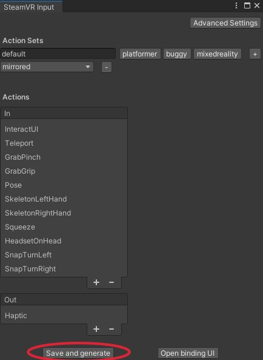
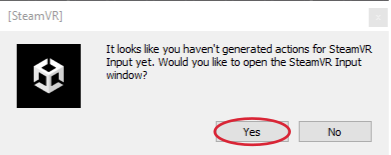
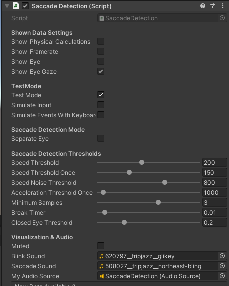

# Saccade Detection
A simple (heuristic-based) algorithm for online **saccade onset** and **blink** detection with the HTC Vive Pro Eye VR headset. The saccade detection is inspired by Sun et al.'s algorithm (2018). We calculate the eye gaze *velocity* by comparing the two previous data samples for each frame. With this, we determine the eye gaze *acceleration*. In our algorithm, we also consider the noise data of the eye tracker by introducing a *speed noise threshold*. Whenever this threshold is exceeded, we assume the high velocity to be caused by noise. All the mentioned calculations have their own threshold parameters (*speed threshold*, *acceleration threshold*, ..) that must be exceeded. Only when all these saccade detection parameters are fulfilled, a saccade is detected. The *number of successive samples* that must fulfill these criteria can be adapted too. With the *separate eye* setting, you have the possibility to consider the more conservative velocity value of the left and right eye velocity. 

Most parameters of the Saccade Detection **algorithm can be modified in the inspector**.  
Per default, the parameters are configured to perform well for our (few) test users and us. However, depending on your usage, another setting might perform more reliably - so feel free to adjust the given parameters.  

For debugging purposes, detections are indicated by a sound and a message in the console.  
Specifically, whenever a saccade occurs, a sound is played, and 'saccade detected' appears in the console. Once a saccade onset is detected, the event `SaccadeOccured` is fired, and the `saccade` variable turns `true`. A blink detection is also written into the console and signalized with a different sound. Once a blink is detected, the event `BlinkOccured` is fired, and the `blink` variable turns `true`.

## Download
To use our saccade detection, download and import [**saccade-detection-v4.unitypackage**](saccade-detection-v4.unitypackage) into your Unity project (tested with Unity version 2021.3.7f1 LTS).

## Requirements
To use our saccade detection in your Unity application, make sure to have the following assets imported into your project:

- [**SteamVR**](https://assetstore.unity.com/packages/tools/integration/steamvr-plugin-32647)
- [**SRanipal**](https://developer.vive.com/resources/vive-sense/eye-and-facial-tracking-sdk/download/latest/)

After importing both requirements, you will be asked whether you want to accept the recommended project settings for SteamVR. Click on *Accept all*. 

  

Click on *Window* and open the *SteamVR Input*. Click on *yes* in the new pop-up window to import the SteamVR Example Input File.  

Click on *save and generate* in the SteamVR Input window. 

  

However, if you did not generate the SteamVR action set yourself, when starting the scene (and the headset is connected correctly), SteamVR Input will automatically ask you to import the action set. Then select the answers as described above.  

  

## How to Use
### Example Scene
To check out an example scene, open and start any of the scenes coming with our package. For further details, look at the corresponding [Example Scene](#example-scenes) section  

### Adding Saccade Detection to Your Scene
Add to your scene:  

  - **`SaccadeDetection prefab`**  
  - **`SRanipal_Eye_Framework prefab`** from SRanipal (ViveSR)   
    - check the `Enable Eye Data` box  
    - select *Version 2* for `Enable Eye Version`  
  - **`CameraRig prefab`** from SteamVR  
    

  

**Accessing data**:

The data can easily be accessed by reading the public variable **saccade** of the Saccade Detection or by subscribing a callback method to the events **saccadeOccured()** and **saccadeIsOver()** (same with accessing the blink data).  

**ExampleScript1** for accessing the data **via public variables**:  

  

**ExampleScript2** for accessing the data **via events**:  

  

To **subscribe to the unity events** you need to assign the GameObject carrying the script to the corresponding event. In this example, I created an empty GameObject called *readData* and attached the script above (*ExampleScript2*). Then you need to match the different methods from the script to the events.  

  

## Saccade Detection Inspector
All the saccade and blink detection logic is implemented by the `SaccadeDetection` script (which is part of the prefab).  
The picture below shows the *Saccade Detection Inspector* including all *adjustable variables*.

### Shown Data Settings  
prints certain variable values into the console, such as:

`Show_PhysicalCalculations`  
*true*: writes **angle, speed, and acceleration** values for the current retrieved eye data into the console.

`Show_Framerate`  
*true*: writes the current **Update and EyeTracker frequency** for each second into the console.

`Show_Eye`  
*true*: writes **'Eyes closed'** into the console whenever the `EyeValue` falls below the `closedEyeThreshold`.

`Show_EyeGaze`  
*true*: shows the eye gaze in real-time.

### Test Mode  
`Test Mode`  
*true*: the given setup is used along with the Test Scenario Module

`Simulate Input`  
*true*: the **tracking values** of the `.csv inputFile` in `TestScenario` **are used** for every algorithm analysis, resulting in better algorithm comparisons.

`Simulate Events with Keyboard`  
*true*: the saccade onset/end and the blink onset/end events can be triggered with the keyboard (left shift: saccade, right shift: blink).  

### Saccade Detection Mode  

`Separate Eye`  
*true*: all physical calculations are computed **separately for each eye**. ** Both** eyes' values must exceed the corresponding thresholds.  
*false*: all physical calculations are computed according to the **combined eye value**.

### Saccade Detection Thresholds  

`Speed Threshold`  
Speed Threshold for Saccade Detection *[degrees/ second]*. If **eye rotation > threshold**, it might be a saccade.

`Speed Threshold Once`  
Speed Threshold for Saccade Detection *[degrees/ second]* only needs to be **exceeded ONCE in 3 frames**.  

`Speed Noise Threshold`  
Speed Threshold above, which considered measured speed as noise *[degrees/ second]*. If **eye rotation > threshold**, the current sample does not increase the sample counter.

`Acceleration Threshold Once`  
Acceleration Threshold for Saccade Detection *[degrees/ second²]*. If **one in 3 eye rotation > threshold**, it might be a saccade.

`Minimum Samples`  
**How many** of the most recent **speed samples must exceed** the defined speedThreshold.  

`Break Timer`  
For **breakThreshold seconds** after a blink, there will be **no saccades detected**. If the value is too low, the algorithm might detect a non-existing saccade due to the high acceleration when opening the eyes.

`Closed Eye Threshold`  
The threshold determines whether the eye is interpreted as **closed** (if **eyeOpeness < closedEyeThreshold**). Eye Openness values range *from 0.0 (closed) to 1.0 (open)*.

### Adjusting of the Parameters
Higher *Speed Threshold, Speed Threshold Once, Acceleration Threshold* and/ or the *Sample Threshold* ➜ Later saccade detection, smaller saccades will not be detected (**important**: the false rate might increase due to the *allowedRange* parameter in the `TestScenario` - meaning that right but late detections count as false. To receive a better true/ false analysis independent of the detection delay, increase the *allowedRange*)   

Higher *Speed Noise Threshold* ➜ More use of noisy data, more false saccade detections  

Higher *Break Threshold* ➜ Bigger detection break after a blink, less right saccade detections after a blink, less false saccade detections after a blink due to inaccurate tracking/ noise  

Higher *Closed Eye Threshold* ➜ More blinks, more detection breaks, less noisy data used, which might occur during blinks  

## Example Scenes
The *three* Example Scenes differ in the saccade size: **Easy, Medium, Difficult** (large, medium, and small saccades).  

**Procedure**:  
There are multiple cubes placed on the desk. Focus the highlighted cube until the next one lights up.   
First, the starting cube lights up. After focusing it for a given time, the next cube lights up until it is also focused for a given time. Then the procedure repeats for the starting cube and the next cube.  
After these cube changes, when the eye gaze leaves the old cube and moves towards the new cube, we expect a saccade (called saccade ground truth). Our analysis then checks whether a saccade has been detected or not.
Therefore, to receive a good analysis for the saccade detection settings, it is **necessary to perform a straight eye movement from the old cube to the new cube**. There must be no accidental eye movement between the changing cube highlights - this would lead to a false analysis.

**Scene Setup**:  
The cubes are placed in distances according to the current example scene. The cube in the very front is the starting cube.

**Hierarchy**:  
The main elements are: [Saccade Detection](#saccade-detection-settings), [Eye Tracking](#requirements), [SteamVR](#requirements), Test Scene Logic, Visualization & Room  
The Test Scene Logic consists of the Logging and the Test Scenario Module.  

**Logging Inspector**:  
The Logging Module frame-wise logs the values of different variables and stores them in a .csv file. Therefore, it needs the directory path to store the file. Additionally, you can decide whether you want the file to be overwritten when starting the scene again or a new file should be created each time. 

**Test Scenario Inspector**:  
The Test Scenario checks whether the highlighted cube has been focused for the given time, manages the cube highlighting order, and knows when a saccade should occur (saccade ground truth). So the Test Scenario contains the main test procedure.  

`Duration`  
How long each cube needs to be focused until the cube switches *[ms]* 

`Input Path`  
The path of the input file which should be used for the simulation of the *TestScenario*. **important**: the file needs to have a specific structure. For the simulation it is the easiest to use a loggingFile created during the TestMode earlier.  

`Allowed Range`   
**How many timestamps before/ after the true saccade onset count as correctly detected**. *The higher*, the more correct the correct/ false rate, but also, quite late detections count as correct. *The lower*, the higher the false rate since it will contain right but late detections.

## References  
Qi Sun, Anjul Patney, Li-Yi Wei, Omer Shapira, Jingwan Lu, Paul Asente, Suwen Zhu, Morgan Mcguire, David Luebke, and Arie Kaufman. 2018. Towards virtual reality infinite walking: dynamic saccadic redirection. ACM Trans. Graph. 37, 4, Article 67 (August 2018), 13 pages. https://doi.org/10.1145/3197517.3201294  

## Credits
Before use, please see the [LICENSE](LICENSE.md) for copyright and license details.

This open-source package is part of the DFG project [VHIVE](https://www.inf.uni-hamburg.de/en/inst/ab/hci/projects/vhive.html) and was created by [André Zenner](https://umtl.cs.uni-saarland.de/people/andre-zenner.html) and Chiara Karr at the [UMTL](https://umtl.cs.uni-saarland.de/) at Saarland University.
This work was supported by the Deutsche Forschungsgemeinschaft (DFG, German Research Foundation), the [Deutsches Forschungszentrum für Künstliche Intelligenz GmbH](https://www.dfki.de/) (DFKI; German Research Center for Artificial Intelligence), and [Saarland University](https://www.uni-saarland.de/).

