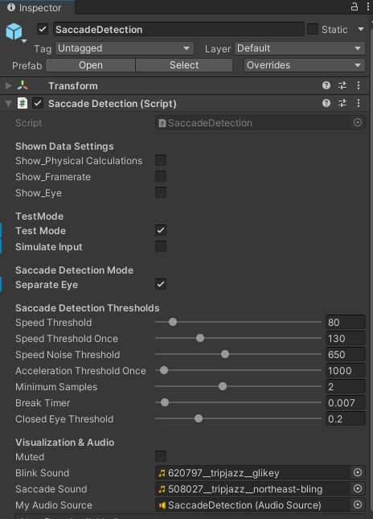

# Saccade Detection
A simple (heuristic-based) algorithm for online **saccade onset** and **blink** detection with the HTC Vive Pro Eye VR headset.  
Most parameters of the Saccade Detection **algorithm can be modified in the [inspector](#saccade-detection-settings)**.  
We chose a setting which fits quite well in our eyes. However, depending on your usage, another setting might perform more reliable - so feel free adjusting the given parameters.  
Detections can be noticed by hearing a sound or when looking in the console.  
Whenever a saccade occurs a sound is played and 'saccade detected' shows up in the console. Once a saccade onset is detected the event *SaccadeOccured* is fired and the *saccade* variable turns true. When a blink is detected a different sound is played and is also written into the console. Once a blink is detected the event *BlinkOccured* is fired and the *blink* variable turns true.

## Download
To use our saccade detection, simply download and import [**saccade-detection-v2.unitypackage**](saccade-detection-v2.unitypackage) into your Unity project (tested with Unity version 2021.3.7f1 LTS).

## Requirements
To use our saccade detection in your own Unity application, make sure to have the following assets imported in your project:

- [**SteamVR**](https://assetstore.unity.com/packages/tools/integration/steamvr-plugin-32647)
- [**SRanipal**](https://developer.vive.com/resources/vive-sense/eye-and-facial-tracking-sdk/download/latest/)

## How to use
### Example Scene
To check out an example scene, just open and start any of the scenes that come with our package. For further details look at the corresponding [Example Scene](#example-scenes) section  

### Implement Own Scene
add to your scene:  

  - **`SaccadeDetection prefab`**  
  - **`SRanipal Eye Framework prefab`** from SRanipal (ViveSR)   
    - check the `Enable Eye Data` box  
    - select *Version 2* for `Enable Eye Version`  
  - **`CameraRig prefab`** from SteamVR  
    

## Saccade Detection Inspector
The picture below shows the *Saccade Detection Inspector* including all *adjustable variables*.

### Shown Data Settings  
prints certain variable values into the consolem, such as:

`Show_PhysicalCalculations`  
*true*: writes **angle, speed and acceleration** values for current retrieved data into the console.

`Show_Framerate`  
*true*: writes the current **Update and EyeTracker frequence** for each second into the console.

`Show_Eye`  
*true*: writes **'Eyes closed'** into the console whenever the EyeValue undercuts the closedEyeThreshold.

### Test Mode  
`Test Mode`  
*true*: the given setup is used along with the Test Scenario Module

`Simulate Input`  
*true*: the **tracking values** of the `.csv inputFile` in `TestScenario` **are used** for every algorithm analysis, resulting in better algorithm comparisons.

### Saccade Detection Mode  

`Separate Eye`  
*true*: all physical calculations are computed **for each eye**. The corresponding thresholds must exceed **both** eye values.  
*false*: all physical calculations are computed according to the **combined eye value**.

### Saccade Detection Thresholds  

`Speed Threshold`  
Speed Threshold for Saccade Detection *[degrees/ second]*. If **eye rotation > threshold** then it might be a  saccade.

`Speed Threshold Once`  
Speed Threshold for Saccade Detection *[degrees/ second²]* which only needs to be **exceeded ONCE in 3 frames**. This is included in the sample threshold.

`Speed Noise Threshold`  
Speed Threshold above which considered measured speed as noise *[degrees/ second]*. If **eye rotation > threshold** then the current sample does not increase the sample counter.

`Acceleration Threshold`  
Acceleration Threshold for Saccade Detection *[degrees/ second²]*. If **eye rotation > threshold** then it might be a saccade.

`Sample Threshold`  
**How many** of the most recent **speed samples must exceed** the defined speedThreshold. OnceSpeed is included in this one.

`Break Threshold`  
For **breakThreshold seconds** after a blink there will be **no saccades detected**.

`Closed Eye Threshold`  
Threshold which determines whether the eye is interpreted as **closed** (if **eyeOpeness < closedEyeThreshold**) or not. Eye Openess values are in the range *from 0.0 (closed) to 1.0 (open)*.

## Example Scenes
There are *three* different Example Scenes which differ in the occuring saccade size: **Easy, Medium, Difficult**.  

**Procedure**:  
There are multiple cubes placed on the desk. Whenever a cube lights up - after focusing it for a given time the next cube will light up.  
First the starting cube lights up. After focusing it for a given time, the next cube lights up until it is also focused for a given time. Then the procedure repeats for the starting cube and the next cube.  
After these cube changes, when the eye gaze leaves the old cube and moves towards the new cube, we expect a saccade (called saccade ground truth). Our analysis then checks whether a saccade has been detected or not.
Therefore, to receive a good analysis for the saccade detection settings, it is **necessary to perform a straight eye movement from the old cube to the new cube**. In between the changing cube highlights there must be no accidental eye movement - this would lead to a false analysis.

**Scene Setup**:  
The cubes are placed in distances according to the current example scene. The cube in the very front is the starting cube.

**Hierarchy**:  
The main elements are: [Saccade Detection](#saccade-detection-settings), [Eye Tracking](#requirements), [SteamVR](#requirements), Test Scene Logic, Visualization & Room  
The Test Scene Logic consists of the Logging *(see below)* and the Test Scenario Module.  
The Test Scenario checks whether the highlighted cube has been focused for the given time, manages the cube highlighting order and knows when a saccade should occur (called saccade ground truth). So the Test Scenario manages the main test procedure.  

**Logging Inspector**:  
The Logging Module frame-wise logs the values of different variables and stores them in a .csv file. Therefore, it needs the path of the directory in which the file should be stored. Additionally, you can decide whether you want the file to be overwritten when starting the scene again or a new file should be created each time. 

## Credits
Before use, please see the [LICENSE](LICENSE.md) for copyright and license details.

This open-source package is part of the DFG project [VHIVE](https://www.inf.uni-hamburg.de/en/inst/ab/hci/projects/vhive.html) and was created by [André Zenner](https://umtl.cs.uni-saarland.de/people/andre-zenner.html) and Chiara Karr at the [UMTL](https://umtl.cs.uni-saarland.de/) at Saarland University.
This work was supported by the Deutsche Forschungsgemeinschaft (DFG, German Research Foundation), the [Deutsches Forschungszentrum für Künstliche Intelligenz GmbH](https://www.dfki.de/) (DFKI; German Research Center for Artificial Intelligence), and [Saarland University](https://www.uni-saarland.de/).

